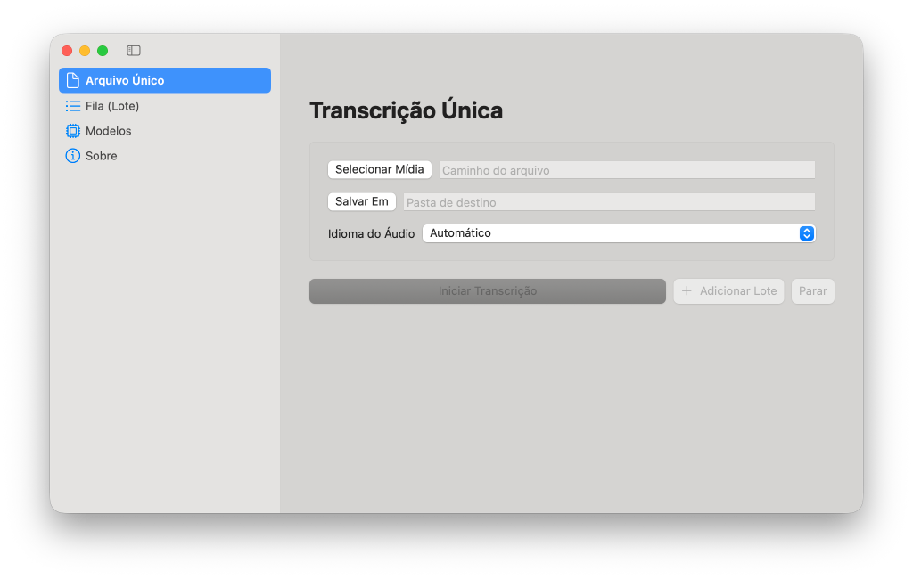
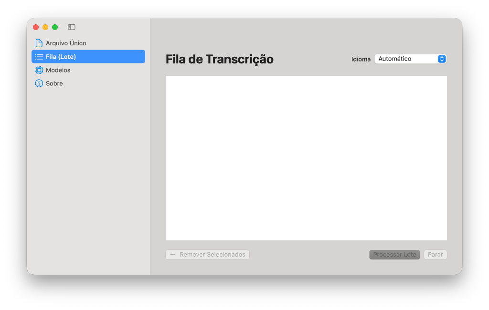

# Transcritor Local

Transcreva áudios e vídeos de forma local e privada, sem enviar arquivos para serviços externos.

O **Transcritor Local** é uma aplicação multiplataforma (Windows e macOS) com interface gráfica que usa `faster-whisper` (Whisper sobre CTranslate2) para transcrever áudio e vídeo localmente. Suporta aceleração por GPU NVIDIA (CUDA) com fallback automático para CPU.

Para cada arquivo de entrada, a ferramenta gera:
- `.txt` — texto corrido
- `.timestamped.txt` — texto com marcações de tempo `[hh:mm:ss]`
- `.srt` — legenda SubRip
- `.vtt` — legenda WebVTT

Formatos aceitos: MP3, MP4, M4A, WAV, OGG, FLAC, AAC, WebM, MKV e MOV.

## Interface Gráfica




## Instalação

### Opção 1: Baixar o executável pronto (recomendado)

Vá para a página de [Releases](https://github.com/redmagikarp13/transcritor-local-gui/releases) e baixe a versão para o seu sistema:

- **Windows:** `TranscritorLocal.exe`
- **macOS:** `TranscritorLocal-Mac.zip`

Não é necessário instalar Python nem nenhuma dependência. Basta baixar e executar!

> **Nota para Windows:** Se quiser usar aceleração por GPU NVIDIA, instale o [CUDA Toolkit 12](https://developer.nvidia.com/cuda-downloads) antes de executar o programa.

### Opção 2: Instalar a partir do código-fonte

#### Pré-requisitos

- Python 3.10 ou superior
- (Opcional) GPU NVIDIA com CUDA Toolkit 12 para aceleração por GPU

#### 1. Clone o repositório

```powershell
git clone https://github.com/redmagikarp13/transcritor-local-gui.git
cd transcritor-local-gui
```

#### 2. Crie e ative o ambiente virtual

No Windows/PowerShell:

```powershell
python -m venv .venv
.\.venv\Scripts\Activate.ps1
python -m pip install --upgrade pip
pip install -r src\transcritor\core\requirements.txt
pip install -r gui_requirements.txt
```

No Linux/macOS:

```bash
python3 -m venv .venv
source .venv/bin/activate
python -m pip install --upgrade pip
pip install -r src/transcritor/core/requirements.txt
pip install -r gui_requirements.txt
```

#### 3. Inicie a interface gráfica

No Windows:

```powershell
.\start_gui.bat
```

No Linux/macOS:

```bash
./start_gui.sh
```

## Uso via CLI

Coloque um ou mais arquivos em `inbox/` e execute:

```powershell
python src\transcritor\core\transcribe.py
```

Para transcrever um arquivo específico:

```powershell
python src\transcritor\core\transcribe.py "C:\caminho\para\audio.m4a"
```

Os resultados ficam em `output/`. Na primeira execução o modelo escolhido é baixado automaticamente e fica em cache local para os próximos usos.

## Configuração

As configurações ficam em `src/transcritor/core/config.toml` e podem ser editadas pela aba **Configurações** da interface gráfica:

| Campo | Função |
|---|---|
| `model` | Modelo Whisper (`tiny`, `base`, `small`, `medium`, `large-v3`) |
| `device` | `auto`, `cpu` ou `cuda` |
| `compute_type` | Quantização: `int8`, `float16` ou `float32` |
| `language` | Idioma do áudio (`pt`, `en`, `es`) ou `auto` para detecção automática |

### Qual modelo usar (por VRAM)

| VRAM dedicada | `model` recomendado | `compute_type` |
|---|---|---|
| 2 GB | `medium` | `int8` |
| 4 GB | `large-v3` | `int8` ou `float16` |
| Sem GPU / CPU | `medium` ou `small` | `int8` |

### Aceleração por GPU (NVIDIA)

Para usar CUDA, instale o [CUDA Toolkit 12](https://developer.nvidia.com/cuda-downloads) e as bibliotecas NVIDIA:

```powershell
pip install nvidia-cublas-cu12 "nvidia-cudnn-cu12==9.*"
```

O programa detecta automaticamente a GPU disponível e faz fallback para CPU se necessário. Consulte o [guia detalhado de instalação](setup/install.md) para configuração de cuDNN no Windows.

## Pós-processamento com IA (Stage 02)

Após transcrever, abra um assistente de IA neste workspace e solicite um dos tratamentos sobre o arquivo `output/<slug>.txt`:

| Pedido | Resultado |
|---|---|
| "limpa a transcrição" | Remove vícios de fala, corrige pontuação, sem alterar conteúdo |
| "faz um resumo" | Resumo executivo com tópicos principais |
| "faz a ata" | Ata com participantes, decisões, pendências e próximos passos |

Saída em `output/<slug>.<tipo>.md` (ex.: `reuniao.ata.md`).

## Privacidade

O `.gitignore` garante que nunca sejam versionados:
- áudios e vídeos em `inbox/`
- transcrições em `output/`
- ambiente virtual e dependências instaladas
- configurações locais, caches e modelos baixados

## Solução de problemas

- **Nada para transcrever:** coloque um formato suportado em `inbox/` ou informe o caminho do arquivo.
- **Falta de memória:** use `model = "small"` ou `model = "medium"` com `compute_type = "int8"`.
- **Erro de CUDA/cuDNN:** use `device = "cpu"` temporariamente ou siga o [guia de instalação](setup/install.md). O programa tenta fallback automático GPU → CPU.
- **PowerShell bloqueia a ativação:** execute `Set-ExecutionPolicy -Scope Process -ExecutionPolicy Bypass` e ative novamente.

## Licença

Distribuído sob a [licença MIT](LICENSE).
