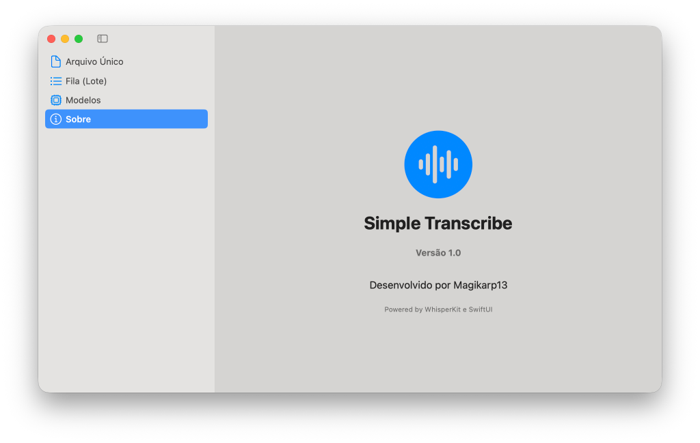

# Transcritor Local

Transcreve audios e videos no proprio computador com
[faster-whisper](https://github.com/SYSTRAN/faster-whisper), sem enviar os arquivos
para servicos externos.

Para cada arquivo de entrada, a ferramenta gera:

- `.txt` — texto corrido;
- `.timestamped.txt` — texto com marcacoes de tempo;
- `.srt` — legenda SubRip;
- `.vtt` — legenda WebVTT.

Funciona em lote com todos os arquivos de `inbox/` ou com um arquivo indicado na
linha de comando. Os formatos aceitos incluem MP3, MP4, M4A, WAV, OGG, FLAC, AAC,
WebM, MKV e MOV.

## Interface para macOS (Simple Transcribe)

O projeto agora possui uma interface gráfica nativa para macOS, super rápida e elegante, utilizando `WhisperKit` e a aceleração Neural Engine da Apple.
Ela possui suporte a múltiplos idiomas e processamento em lote.




Você pode baixá-la via Homebrew Cask (veja as instruções abaixo) ou executando o script `./build_app.sh` se quiser compilá-la localmente no Xcode/Swift.

## Para quem vai instalar pela primeira vez

### 1. Obtenha o projeto

Voce pode fazer um fork no GitHub e clonar o seu fork:

```powershell
git clone https://github.com/SEU-USUARIO/transcritor-local.git
cd transcritor-local
```

Ou clonar diretamente este repositorio:

```powershell
git clone https://github.com/marcosaccioly/transcritor-local.git
cd transcritor-local
```

### 2. Crie e ative um ambiente virtual

Recomenda-se Python 3.10 a 3.12.

No Windows/PowerShell:

```powershell
python -m venv .venv
.\.venv\Scripts\Activate.ps1
python -m pip install --upgrade pip
pip install -r tools\requirements.txt
```

No Linux/macOS:

```bash
python3 -m venv .venv
source .venv/bin/activate
python -m pip install --upgrade pip
pip install -r tools/requirements.txt
```

### 3. Crie sua configuracao local

No Windows/PowerShell:

```powershell
Copy-Item tools\config.example.toml tools\config.toml
```

No Linux/macOS:

```bash
cp tools/config.example.toml tools/config.toml
```

Edite `tools/config.toml` se quiser mudar modelo, idioma, CPU/GPU ou qualidade. O
arquivo e ignorado pelo Git para que a configuracao de cada maquina nunca seja
publicada nem sobrescrita por atualizacoes.

### 4. Transcreva

Coloque um ou mais arquivos em `inbox/` e execute:

```powershell
python tools\transcribe.py
```

Para transcrever somente um arquivo, inclusive fora da pasta `inbox/`:

```powershell
python tools\transcribe.py "C:\caminho\para\audio.m4a"
```

No Linux/macOS, use barras normais nos caminhos, por exemplo
`python tools/transcribe.py inbox/audio.m4a`.

Os resultados ficam em `output/`. A primeira execucao baixa o modelo escolhido e
pode demorar mais; ele permanece no cache local para os proximos usos.

## Para quem ja usa o projeto

Antes de atualizar, confirme que alteracoes suas em arquivos versionados foram
salvas em commit ou stash. Depois, na pasta do projeto:

```powershell
git pull
.\.venv\Scripts\Activate.ps1
pip install -r tools\requirements.txt
```

Se voce ainda nao tiver `tools/config.toml`, crie-o a partir do exemplo:

```powershell
Copy-Item tools\config.example.toml tools\config.toml
```

Quem ja possui esse arquivo nao precisa recria-lo: ele continua local e nao sera
alterado pelo `git pull`. Audios em `inbox/`, transcricoes em `output/`, o ambiente
`.venv` e os modelos baixados tambem permanecem fora do versionamento.

## Configuracao

O exemplo usa CPU com quantizacao `int8`, opcao mais compativel entre maquinas.
Os campos de `tools/config.toml` sao:

| Campo | Funcao |
|---|---|
| `model` | Modelo Whisper (`small`, `medium`, `large-v3` etc.) |
| `device` | `cpu`, `cuda` ou `auto` |
| `compute_type` | Quantizacao, como `int8` ou `float16` |
| `language` | Idioma do audio, como `pt`, ou `auto` |
| `vad_filter` | Ignora trechos sem voz |
| `beam_size` | Equilibrio entre uso de memoria, velocidade e busca |
| `chunk_minutes` | Tamanho dos blocos usados em audios longos |

Para configurar CUDA no Windows, escolher um modelo conforme a VRAM e resolver
problemas de cuDNN/cuBLAS, consulte o
[guia detalhado de instalacao](setup/install.md). Para os comandos mais usados,
consulte o [guia rapido](CONTEXT.md).

## Privacidade e arquivos locais

O `.gitignore` impede o versionamento de:

- audios e videos colocados em `inbox/`;
- transcricoes e materiais gerados em `output/`;
- ambiente virtual e dependencias instaladas;
- configuracoes locais, caches e modelos;
- logs, arquivos temporarios e configuracoes locais de editores/agentes.

Mesmo assim, sempre confira `git status` antes de criar um commit, principalmente
se adicionar novas pastas ao projeto.

## Solucao de problemas

- **Nada para transcrever:** coloque um formato suportado em `inbox/` ou informe o
  caminho do arquivo no comando.
- **Falta de memoria:** use `model = "small"` ou `model = "medium"`, mantenha
  `compute_type = "int8"` e reduza `beam_size` para `1`.
- **Erro de CUDA/cuDNN:** use temporariamente `device = "cpu"` ou siga o guia de
  instalacao. O script tambem tenta fazer fallback automatico da GPU para a CPU.
- **PowerShell bloqueia a ativacao:** execute
  `Set-ExecutionPolicy -Scope Process -ExecutionPolicy Bypass` e ative novamente.

## Licenca

Distribuido sob a [licenca MIT](LICENSE).
